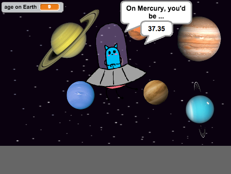

## Introduction

British astronaut Tim Peake is going on the Principia mission to the International Space Station which is in orbit around Earth. Tim will be setting up Astro Pi computers running children's code on the Space Station.

You are going to code an alien that will tell you how old you'd be if you lived on another planet.

  <iframe allowtransparency="true" width="485" height="402" src="https://scratch.mit.edu/projects/embed/88123334/?autostart=false" frameborder="0"></iframe>
  

### Additional information for club leaders

If you need to print this project, please use the [Printer friendly version](https://projects.raspberry-pi.org/en/projects/space-age/print).

--- collapse ---
---
title: Club leader notes
---

## Introduction:
In this project, children will learn how to perform calculations, and how to broadcast messages between sprites.

## Resources
For this project, Scratch 2 should be used. Scratch 2 can either be used online at [jumpto.cc/scratch-on](http://jumpto.cc/scratch-on) or can be downloaded from [jumpto.cc/scratch-off](http://jumpto.cc/scratch-off) and used offline.

The 'Project Materials' link for this project contains the following resources:

##### Club leader Resources

You can find a completed version of this project <a href="http://scratch.mit.edu/projects/88123334/#editor">online</a>, or it can be downloaded by clicking the 'Project Materials' link for this project, which contains:

+ SpaceAge.sb2

##### Project Resources

For this project, club members can make use of a Scratch project containing the required resources. This project is available at [jumpto.cc/space-age-resources](http://jumpto.cc/gravity-resources), or it can be downloaded by clicking the 'Project Materials' link for this project, which contains:

+ SpaceAgeResources.sb2

Make sure that each child has access to a copy of these resources.

## Learning Objectives
+ Variables;
+ Calculations using operator blocks;
+ Broadcasting messages between sprites.

This project covers elements from the following strands of the [Raspberry Pi Digital Making Curriculum](http://rpf.io/curriculum):

+ [Use basic programming constructs to create simple programs.](https://www.raspberrypi.org/curriculum/programming/creator)

## Challenges
+ "Age on other planets" - Using the time relative to Earth that other planets take to orbit the sun to calculate relative age on other planets;
+ "Age accuracy" - calculating age on Earth in days (and not years) to improve the accuracy of age calculations.

--- /collapse ---

--- collapse ---
---
title: Project materials
---
## Project resources
* [Online Scratch 2 project containing all project resources](http://jumpto.cc/space-age-resources)
* [Downloadable Scratch 2 project containing all project resources](resources/SpaceAgeResources.sb2)

## Club leader resources
* [Online completed Scratch 2 project](http://scratch.mit.edu/projects/88123334/#editor)
* [Downloadable completed Scratch 2 project](resources/SpaceAge.sb2)

--- /collapse ---