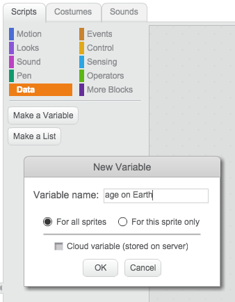
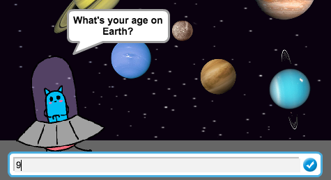

## Storing your age


+ Open the 'Space Age' Scratch project. Your club leader will give you a copy of this project, or you can open it online at <a href="http://jumpto.cc/space-age-resources" target="_blank">jumpto.cc/space-age-resources</a>.

	You should see an alien and some planet sprites.

+ Let's start by creating a variable to store your age on Earth.

	Click `Data`{:class="blockdata"} and then click 'Make a Variable'. Call this variable `age on Earth`{:class="blockdata"}.

	

+ Now we can ask the user how old they are on Earth, and store their answer. Click on your 'Alien' sprite, and add this code:

	```scratch
		when flag clicked
		ask [What's your age on planet Earth?] and wait
		set [age on Earth v] to (answer)
		say [Click on a planet...] for (2) secs
	```

	You can find the `answer`{:class="blocksensing"} block in the `sensing`{:class="blocksensing"} section.

+ Click the green flag to test your project. Enter your age when asked.

	

	Once you have entered your age, you should see that it has been stored in your `age on Earth`{:class="blockdata"} variable.

	


