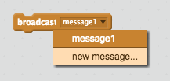
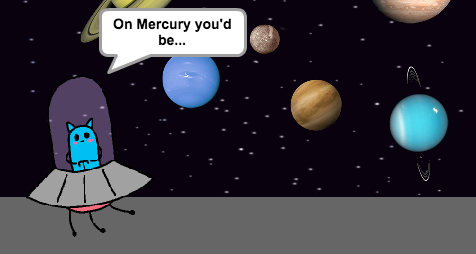
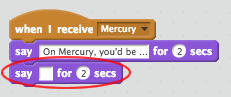
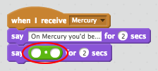
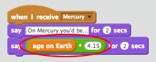
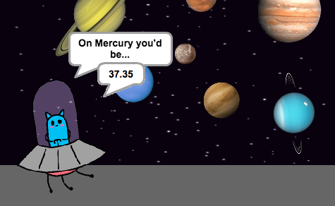

## Your age on Mercury

Let's calculate how old you'd be if you lived on Mercury.


+ Click on your '__Mercury__' sprite (the smallest planet) and add this code:

	```scratch
		when this sprite clicked
		broadcast [Mercury v]
	```

	To create the `broadcast`{:class="blockevents"} block, click the down arrow on the block and enter the text 'Mercury'.

	

	Now, whenever your 'Mercury' sprite is clicked it will broadcast a message to all other sprites.

+ Click on your '__Alien__' sprite, and add this code so that it responds to the message:

	```scratch
		when I receive [Mercury v]
		say [On Mercury, you'd be...] for (2) secs
	```

+ Now test your project again. Clicking on Mercury should cause your Alien to say `On Mercury, you'd be...`.

	

+ You also want your alien to say what your age would be on Mercury.

	To do this, firstly add another `say`{:class="blocklooks"} block to your alien's Mercury code.

	

+ One year on Earth is the time it takes for the Earth to orbit the sun, which is 365 days. Mercury only takes 88 days to orbit the sun, which means that there are 4.15 Mercury years per Earth year (365 ÷ 88 = 4.15).

	Let's multiply your age on Earth by 4.15 to calculate your age on Mercury. In Scratch, the symbol for multiply is `*`{:class="blockoperators"}. Add a multiply block to your Alien's Mercury code.

	

+ To multiply your `age on Earth`{:class="blockdata"} by `4.15`, drag your variable into the first space, and type `4.15` into the second space.

	

+ Test your project by clicking Mercury. Your alien should tell you how old you'd be if you lived on Mercury.

	


