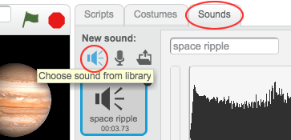

## Travel to Mercury

Code your alien to travel to other planets!

+ Click your '__Alien__' sprite and add a `glide`{:class="blockmotion"} block just before your `say`{:class="blocklooks"} block. Change the block so that the alien takes 2 seconds to glide.

	

+ You want your alien to glide to your 'Mercury' sprite, so you'll need to know the x and y positions of Mercury.

	Click the `sensing`{:class="blocksensing"} tab, and drag an `x position of...`{:class="blocksensing"} block into your `glide`{:class="blockmotion"} block. Make sure that 'Mercury' is selected.

	

+ Do the same for the y position. Make sure that `y position`{:class="blocksensing"} and `Mercury`{:class="blocksensing"} are selected.

	

+ You can also play a sound as the alien is moving. 

	

+ If you prefer, you can even click the 'Sounds' tab and choose your own sound to play.

	

+ Test your project. Your alien should now travel to Mercury and play a sound when clicked.

	

