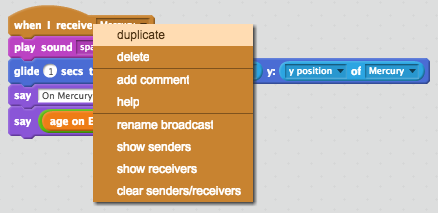
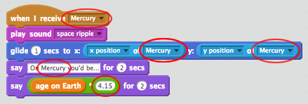

--- challenge ---
## Challenge: Age on other planets
Can you code your alien to travel to other planets, and tell you your age there?

Here are the lengths of a year on each planet, relative to Earth:

| Planet    | Years per Earth year |
|-----------|----------------------|
|Mercury    |4.15 Earth years      |
|Venus      |1.62 Earth years      |
|Mars       |0.53 Earth years      |
|Jupiter    |0.08 Earth years      |
|Saturn     |0.03 Earth years      |
|Uranus     |0.01 Earth years     |
|Neptune    |0.006 Earth years     |

Remember that __each planet__ will need to `broadcast`{:class="blockevents"} a message when it has been clicked.

```scratch
	when this sprite clicked
	broadcast [Mercury v]
```

You can also copy your alien's code to use for your other planets. Right-click on the top of your code and click 'duplicate'.



These are the bits of the duplicated code that you'll need to change:




--- /challenge ---